# 🔐 TruthLock

### On-Chain Fact Checking Powered by GenLayer

**TruthLock** is a decentralized fact-checking protocol that turns claims into **verifiable, permanent on-chain records**.

Submit a claim with or without a source. TruthLock uses **GenLayer Intelligent Contracts**, live web data, LLM reasoning, and validator consensus to determine whether a claim is:

> **TRUE · FALSE · MISLEADING · UNVERIFIABLE**

Each verification produces a permanent on-chain record containing the verdict, confidence score, explanation, evidence status, and verification metadata.

<p align="center">
  <a href="https://truthlockdapp.vercel.app">🌐 Live App</a> ·
  <a href="https://truthlockdapp.vercel.app/developers">🧑‍💻 Developer Hub</a> ·
  <a href="https://genlayer.com">GenLayer</a>
</p>

---

## ✨ Why TruthLock?

The internet contains enormous amounts of information — but determining **what is actually true** remains difficult. Traditional fact-checking is centralized, hard to audit, dependent on a single authority, and not permanently verifiable.

TruthLock approaches the problem differently:

```text
Claim + URL(s) → Live Web Fetch → LLM Cross-Reference → Validator Consensus → Permanent On-Chain Verdict
```

The result isn't just an AI response. **It becomes an on-chain fact-check record that other applications can independently read.**

---

# 🚀 Features

- **🔎 Intelligent Fact Checking** — submit any claim and let the protocol evaluate it using live evidence and LLM reasoning
- **🌐 Live Web Evidence** — the contract fetches provided source URLs directly and analyzes their contents
- **🧠 Multi-Source Reasoning** — extracts additional corroborating sources and compares the available evidence
- **⚖️ Optimistic Democracy Consensus** — validators independently re-run the verification pipeline via `gl.eq_principle.prompt_comparative`
- **⛓️ Permanent On-Chain Verdicts** — verdict, confidence, explanation, sources, fetch status, timestamp, submitter, and verification mode
- **📊 Network Analytics** — verdict distribution, trending claims, source reliability, live verdict feed
- **🕐 Verification Timeline** — the complete lifecycle from submission to on-chain commitment
- **🧑‍💻 Developer Integration** — other dApps read TruthLock verdicts directly from the contract
- **🏛️ Governance Integration** — includes a `GovernanceDAO` reference implementation reading verdicts cross-contract

---

# 🖥️ Application

## Home — Claim Submission

Enter a claim, provide one or more evidence URLs, pick a category, and start the verification. Includes the Claim of the Day and recent fact checks.

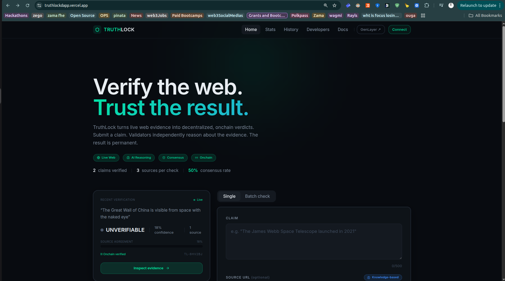

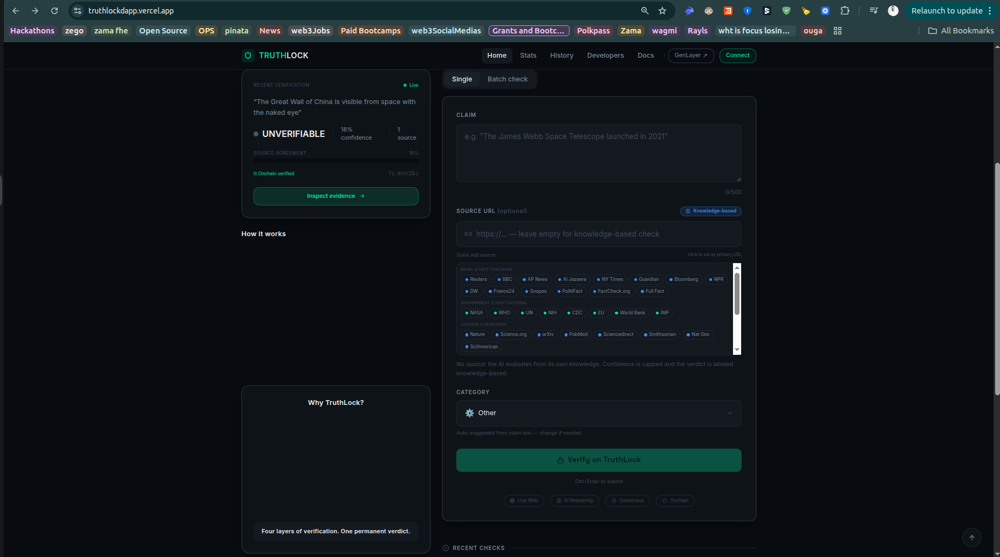

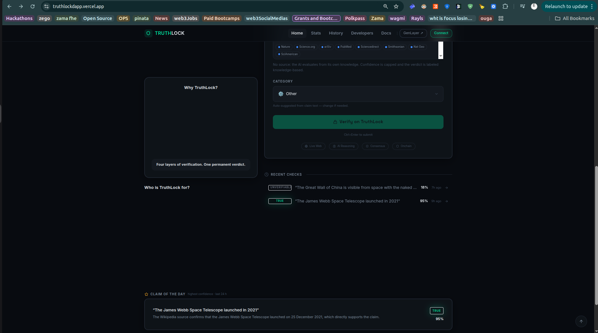

## Verification Result

The primary verdict with confidence, evidence agreement, source verification status, and the verification explanation.

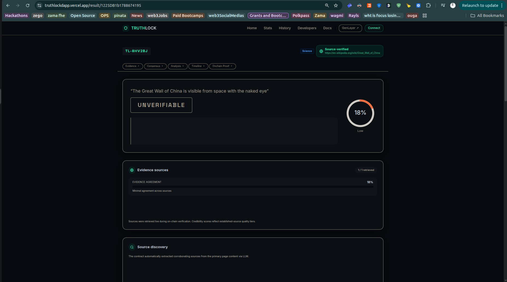

## Verification Analysis

Exposes the reasoning behind the verdict: evidence divergence, validator agreement, source quality tiers, and claim scoring.

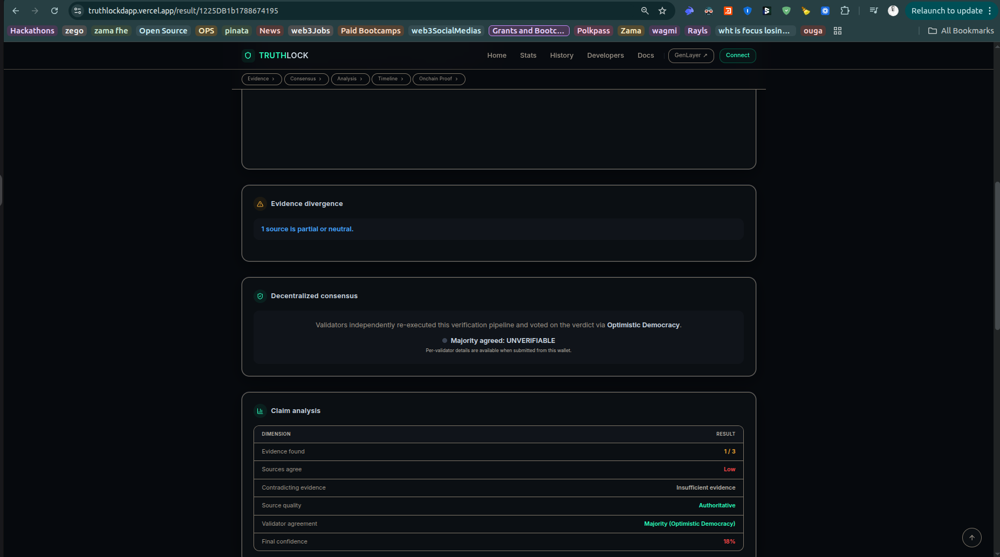

## Verification Timeline

A chronological view of the verification lifecycle — from claim submission to on-chain commitment.

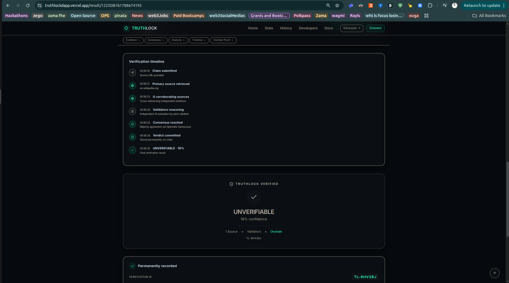

## On-Chain Proof

Transaction ID, timestamp, contract address, submitter wallet, and the immutable verdict record — with export, share, embed, and challenge actions.

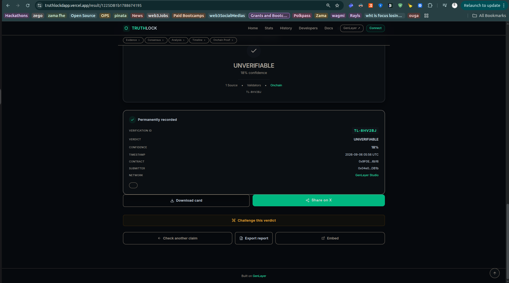

---

# 📊 Network Analytics

A network-level view of fact-checking activity: total claims verified, verdict distribution, verification modes, trending claims, and source reliability.

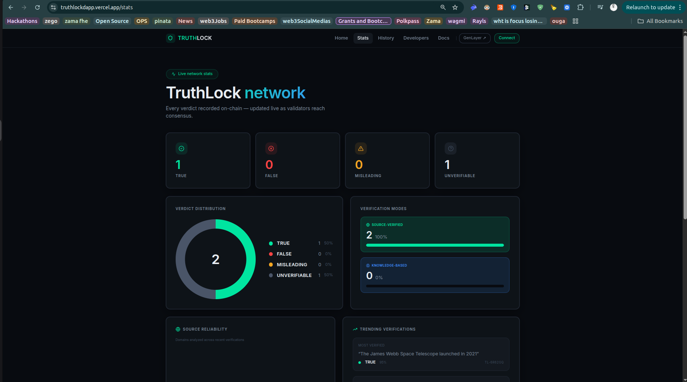

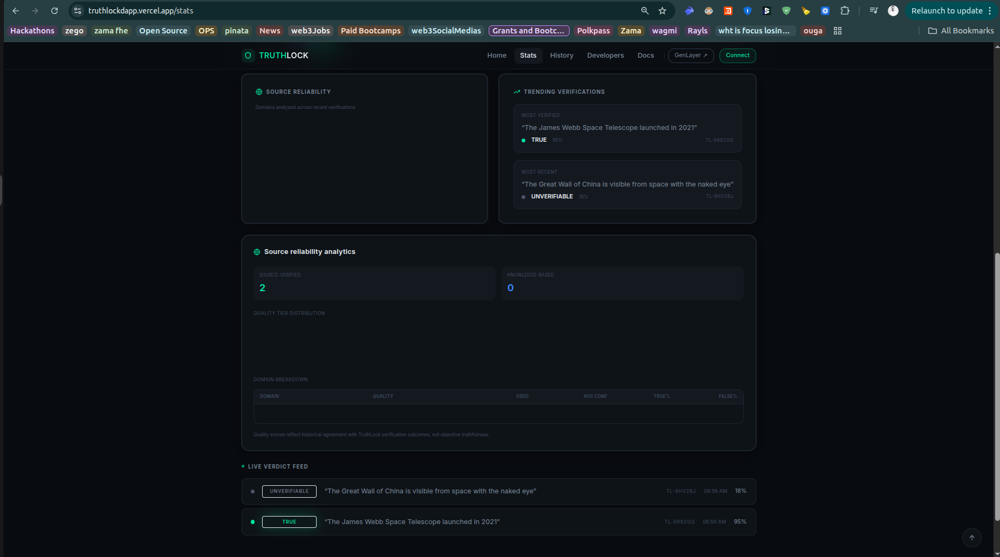

---

# 🗂️ Fact-Check History

A searchable history of verified claims with verdict/category filters and a **14-day misinformation heat map**.

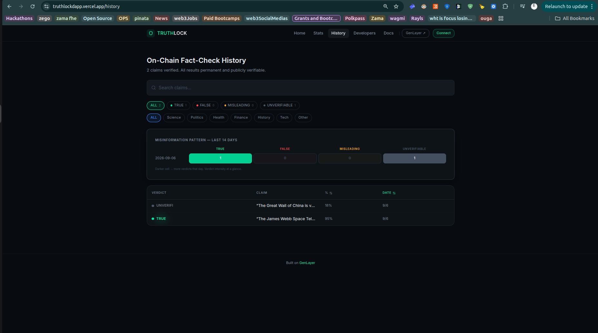

---

# 🧑‍💻 Developer Hub

TruthLock is designed as **fact-checking infrastructure**, not only a consumer application. The Developer Hub provides Python, Solidity, and cURL examples, contract-to-contract integration patterns, and an interactive API playground.

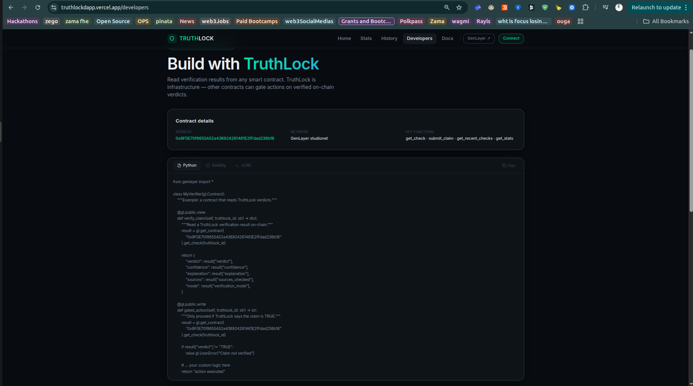

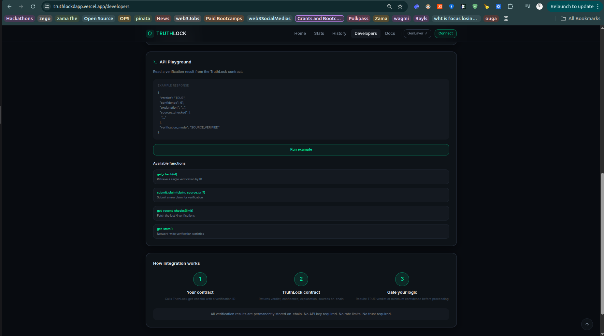

---

# ⚙️ How It Works

TruthLock supports two verification modes.

### 1. `SOURCE_VERIFIED`

The user provides one or more HTTPS source URLs:

1. **Fetch evidence** — the contract retrieves source content with `gl.nondet.web.render(url, mode="text")`
2. **Extract corroborating sources** — the LLM identifies up to two additional corroborating URLs
3. **Cross-reference evidence** — sources are analyzed together for agreement, contradictions, source quality, and evidence strength
4. **Validator consensus** — validators independently re-run the pipeline; consensus via GenLayer's Optimistic Democracy (`gl.eq_principle.prompt_comparative`)
5. **Permanent storage** — the final result is committed on-chain

### 2. `KNOWLEDGE_BASED`

When no source URL is supplied — or all fetches fail — the system falls back to LLM knowledge and explicitly records that **no live evidence was verified**. Maximum confidence is capped at **85%** so knowledge-only verification never appears as strong as live-source verification.

---

# ⛓️ On-Chain Data Model

Each fact check produces a persistent `FactCheckRecord`:

```text
FactCheckRecord
├── ID
├── Claim
├── Verdict
├── Confidence
├── Explanation
├── Verification Mode
├── Source URLs
├── Source Fetch Status
├── Timestamp
└── Submitter
```

| Verdict | Meaning | Color |
| --- | --- | --- |
| 🟢 `TRUE` | Available evidence supports the claim | `#00E5A0` |
| 🔴 `FALSE` | Available evidence contradicts the claim | `#FF4D4D` |
| 🟡 `MISLEADING` | Claim contains materially misleading context | `#FFB800` |
| ⚪ `UNVERIFIABLE` | Evidence is insufficient to establish truth | `#6B7280` |

---

# 🏗️ Architecture

```text
┌──────────────────────────────────────────────┐
│              React SPA                       │
│         Vite + React 19 + TypeScript         │
└──────────────────────┬───────────────────────┘
                       ▼
┌──────────────────────────────────────────────┐
│            GenLayer JS SDK                   │
│      createClient / read / write             │
└──────────────────────┬───────────────────────┘
                       ▼
┌──────────────────────────────────────────────┐
│     TruthLock Intelligent Contract           │
│            Python / GenVM                    │
│  Claim Processing · Web Evidence Retrieval   │
│  LLM Reasoning · Validator Consensus         │
│  On-Chain Storage                            │
└──────────────────────────────────────────────┘
```

**Design principle:** all GenLayer SDK interaction is isolated in `frontend/src/lib/genlayer.ts` — React components never call the SDK directly.

---

# 📁 Repository Structure

```text
.
├── contract/
│   ├── fact_checker.py        # main fact-checker contract
│   ├── governance_dao.py      # GovernanceDAO reference integration
│   └── tests/                 # direct-mode + integration tests
├── frontend/
│   ├── src/lib/genlayer.ts    # all SDK calls isolated here
│   └── src/pages/             # Home, History, Result, Stats, Leaderboard, Governance
├── docs/                      # design system + submission notes
├── Images/                    # README screenshots
├── AGENTS.md
└── README.md
```

---

# 🛠️ Tech Stack

| Layer | Technology |
| --- | --- |
| Smart Contracts | GenLayer Intelligent Contracts |
| Contract Runtime | Python / GenVM |
| Consensus | Optimistic Democracy |
| Web Evidence | `gl.nondet.web.render` |
| Frontend | React 19 + Vite + TypeScript |
| Blockchain SDK | `genlayer-js` |
| Wallet | Browser wallet / MetaMask |
| Testing | Pytest + gltest |
| Deployment | GenLayer Studio |

---

# 🚀 Getting Started

**Prerequisites:** Node.js, npm, Python 3, a browser wallet (e.g. MetaMask), GenLayer CLI.

### 1. Install GenLayer CLI

```bash
npm install -g genlayer
```

> On Linux, additional system packages such as `libsecret` may be required.

### 2. Start Local GenLayer (optional)

```bash
genlayer init
genlayer up
```

### 3. Deploy TruthLock

```bash
genlayer deploy --contract contract/fact_checker.py
# optional governance contract:
genlayer deploy --contract contract/governance_dao.py
```

### 4. Frontend Setup

```bash
cd frontend
npm install
cp .env.example .env
```

Configure `.env`:

```env
VITE_CONTRACT_ADDRESS=0x...
VITE_NETWORK=studionet        # localnet | studionet | testnetAsimov | testnetBradbury
VITE_GOVERNANCE_ADDRESS=
VITE_EXPLORER_URL=
```

```bash
npm run dev   # open http://localhost:3000
```

> Submitting a claim requires a browser wallet. Reading existing verification records does not.

### Use the Existing Deployment

You can also point the frontend at the live contract:

```env
VITE_CONTRACT_ADDRESS=0x3F0E70f8655A52a436924261461E2fFdad236b16
VITE_NETWORK=studionet
```

| | |
| --- | --- |
| **Network** | GenLayer Studio Testnet |
| **Contract** | `0x3F0E70f8655A52a436924261461E2fFdad236b16` |
| **Application** | [truthlockdapp.vercel.app](https://truthlockdapp.vercel.app) |

---

# 🧪 Testing

**Direct tests** (mocked web/LLM, no SDK required):

```bash
python3 -m pytest contract/tests/test_direct.py -v
```

**Integration tests** (requires a Studio/localnet node):

```bash
pip install gltest
export GENLAYER_STUDIO_URL=http://localhost:8080
pytest contract/tests/test_integration.py -v
```

---

# 📡 Smart Contract API

| Method | Type | Description |
| --- | --- | --- |
| `submit_claim(claim, source_url="", source_urls=[])` | Write | Runs the full verification pipeline, returns a check ID |
| `get_check(id)` | View | Returns the complete `FactCheckRecord` |
| `get_recent_checks(limit=10)` | View | Latest verification records (max 50) |
| `get_stats()` | View | Total checks, verdict + mode distribution, latest timestamp |

---

# 🔗 Cross-Contract Integration

Other Intelligent Contracts can consume TruthLock results directly:

```python
truthlock = gl.get_contract("0x3F0E70f8655A52a436924261461E2fFdad236b16")
result = truthlock.get_check(check_id)
```

This makes TruthLock a **shared verification layer** for Governance, DAOs, prediction markets, social networks, news platforms, reputation systems, and AI agents.

---

# 🗺️ Roadmap

- ✅ **Phase 1 — Core Verification** (shipped): claim submission, source-based + knowledge-based verification, multi-source reasoning, validator consensus, on-chain storage, history, analytics, developer examples
- 🚧 **Phase 2 — Publisher Independence**: detect when sources share a publisher/domain/network and weight such agreement lower. *The current deployment records source fetch status but does not yet weight publisher independence.*
- 🔜 **Phase 3 — Dispute & Appeals**: on-chain challenge mechanism → validator re-review → new consensus → updated resolution
- 🔜 **Phase 4 — Reputation-Aware Consensus**: live validator agreement, historical accuracy, and reputation display
- 🔜 **Phase 5 — Public Verification API**: REST API, embeddable verdict badges, developer SDK (the `/embed/:id` widget is the foundation)

> **Long-term vision:** make claims verifiable, evidence auditable, and verdicts composable — a decentralized truth-verification layer for Web3.

---

# 🔐 Security & Trust Model

TruthLock does not treat a single LLM response as ground truth. It combines **web evidence + LLM analysis + multiple sources + validator re-execution + Optimistic Democracy + on-chain storage** — making fact-checking more transparent, reproducible, and composable.

---

# 📜 License

MIT License

---

# ⭐ Built With

**GenLayer Intelligent Contracts** · **GenVM** · **React** · **TypeScript** · **Vite** · **genlayer-js**

**TruthLock — Verify the claim. Preserve the proof.**
